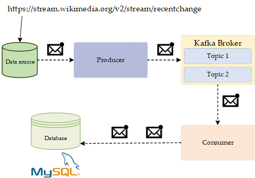
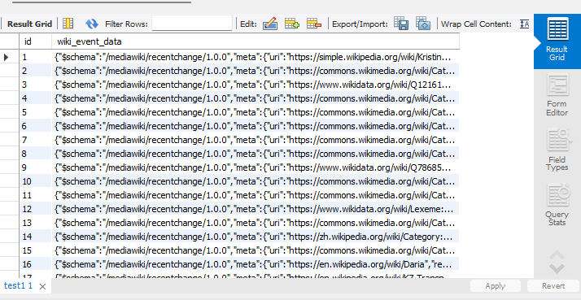

# Kafka Producer-Consumer Application

This repository contains a Kafka producer-consumer application. The producer component fetches real-time stream data from the Wikimedia API and sends it to a Kafka topic named "wikimedia-project". The consumer component listens to messages from the same Kafka topic and persists them into a MySQL database.




# Overview

The application consists of two main components:

1. **Kafka Producer (WikimediaProducer)**: This component fetches real-time stream data from the Wikimedia API using an EventSource client. It then sends the data to a Kafka topic named "wikimedia-project" using a KafkaTemplate.

2. **Kafka Consumer (KafkaDatabaseConsumer)**: This component listens to messages from the Kafka topic "wikimedia-project" using a Kafka listener. Upon receiving a message, it processes the data and persists it into a MySQL database table named "test1".

## Components

### Kafka Producer

The Kafka producer component comprises the following classes:

- **WikimediaProducer**: This class is responsible for fetching real-time stream data from the Wikimedia API and sending it to the Kafka topic "wikimedia-project".

- **WikimediaChangesHandler**: This class implements the EventHandler interface from the launchdarkly-eventsource library. It receives message events from the Wikimedia API and forwards them to the Kafka topic.

### Kafka Consumer

The Kafka consumer component comprises the following classes:

- **KafkaDatabaseConsumer**: This class listens to messages from the Kafka topic "wikimedia-project" using Spring Kafka's KafkaListener annotation. Upon receiving a message, it processes the data and persists it into the MySQL database using Spring Data JPA.

- **WikimediaData**: This class represents an entity mapped to the database table "test1". It utilizes JPA annotations for object-relational mapping and Lombok annotations for generating getters and setters.

- **WikimediaDataRepository**: This interface extends JpaRepository for CRUD operations on WikimediaData entities.

## Project Structure

The project structure is as follows:

- `src/main/java`: Contains Java source files.
- `src/main/resources`: Contains application properties and configuration files.
- `src/test`: Contains test cases.

## Dependencies

The project utilizes the following dependencies:

- **Spring Boot**: Main application framework.
- **Spring Kafka**: Integration with Apache Kafka.
- **Spring Boot Starter Web**: Starter for building web applications.
- **Kafka Streams**: Library for building applications and microservices that process and analyze data stored in Kafka.
- **Lombok**: Generates boilerplate code.
- **Jackson Databind**: Library for JSON serialization and deserialization.
- **OkHttp**: HTTP client for making network calls.
- **Spring Boot Starter Data JPA**: Starter for using Spring Data JPA with Hibernate.
- **MySQL Connector**: Connector for MySQL database.

## Configuration

### Kafka Producer Configuration

The Kafka producer is configured to send messages to the Kafka topic "wikimedia-project". No additional configuration is required.

### Kafka Consumer Configuration

```
spring.kafka.consumer.bootstrap-servers=localhost:9092
spring.kafka.consumer.group-id=myGroup
spring.kafka.consumer.auto-offset-reset=earliest
spring.kafka.consumer.key-deserializer=org.apache.kafka.common.serialization.StringDeserializer
spring.kafka.consumer.value-deserializer=org.apache.kafka.common.serialization.StringDeserializer
```

### Server Configuration

```
server.port=8080
```

### DataSource Configuration for MySQL

```
spring.datasource.url=jdbc:mysql://localhost:3306/wikimedia
spring.datasource.username=root
spring.datasource.password=Your-password
```

### JPA/Hibernate Configuration

```
spring.jpa.properties.hibernate.dialect=org.hibernate.dialect.MySQL8Dialect
spring.jpa.hibernate.ddl-auto=update
spring.jpa.properties.hibernate.show_sql=true
spring.jpa.properties.hibernate.use_sql_comments=true
spring.jpa.properties.hibernate.format_sql=true
```

## Usage

To run the application:

1. Ensure that Kafka is running and accessible from the application.
2. Configure the MySQL database connection in the `application.properties` file.
3. Run the application using the Gradle wrapper:
4. Run the ProducerApplication
5. Run the ConsumerApplication

## Database Output


